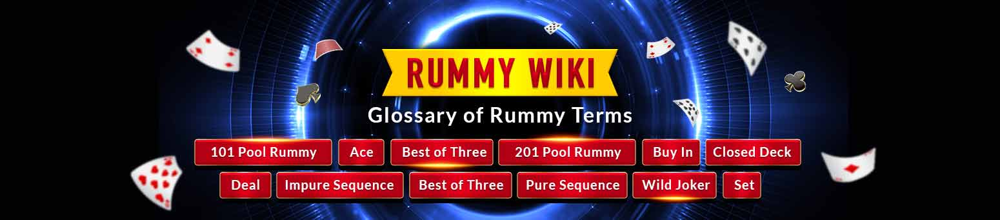

# Rummy Wiki – The Glossary of Rummy Terms

Having difficulty in understanding some rummy terms? Don’t worry. [JungleeRummy.com](http://jungleerummy.com/) provides you with a comprehensive glossary covering all types of games, concepts, [rules and gameplay!](https://www.jungleerummy.com/how-to-play-rummy) We have put together for you an exhaustive list of all the commonly used terms in Indian rummy games.

**101 Pool Rummy:** This variation of rummy has the element of elimination in every deal. The game goes on for a number of deals until all the players except one are eliminated because of having reached 101 points. The losing players get points equal to the total value of their unmatched or unarranged cards at the end of each deal. When a player’s score reaches 101 points, he/she is eliminated from the game and the player who survives till the end is declared the winner.

**201 Pool Rummy:** The game of 201 Pool Rummy is the same as the game of 101 Pool Rummy except that the players are eliminated when they reach 201 points. The player who makes it till the end without accumulating 201 points wins the game.

**Aces:** A standard deck of 52 cards used in rummy contains 4 Aces. They come in the different suits of Clubs, Diamonds, Hearts and Spades. Aces can be used to form a lower-value sequence like Ace 2, 3, or they can be used to form a sequence with high cards, for example Ace, King and Queen. The points carried by each ace are 10\. If a printed Joker is selected as the wild Joker, then Aces also function as wild Jokers, along with the printed Joker.

**Best of Three:** It is a form of Deals Rummy where players play for three rounds. The player who has won the highest number of chips, from the opponents, at the end of the three deals is declared the winner.

**Buy-In:** It refers to the cash amount that one pays to enter a cash rummy tournament. This is also referred to, more commonly, as ‘entry fee,’ which the player puts at stake. The accumulative buy-in forms the prize pool, which is won by the top-performing players of the tournament.

**Closed Deck:** It refers to a deck of face-down cards that are left after cards forming a complete hand have been dealt to each player. Players can pick cards (one on each turn) from the closed deck during their turns. The closed deck is reshuffled when all the cards have been picked by the players.

**Dealing:** It refers to the distribution of cards to each player by the dealer at the start of each hand a round of play). The dealing takes place after a toss is made to choose the dealer.

**Dealer:** The player who deals cards at the start of a hand is called the dealer. In offline games, the players themselves decide on who should be the dealer of the game or make a toss to decide that.

**Deck:** It refers to a pack of cards. A regular rummy deck has 52 cards. In [13-card rummy](https://www.jungleerummy.com/13-cards-rummy), two regular decks of cards including two printed Jokers.

**Declare:** When a player completes the objective of a 13-card rummy game, he/she finishes the game by discarding a card to the finish slot and declaring the cards in his/her hand to the opponents.

**Draw:** On a player’s turn, he/she has to pick a card from the closed or open deck. This process is called drawing a card.

**Discard:** On a player’s turn, he/she has to draw a card from the closed or dpen deck and then put a card facing up on the open deck. This process of putting a card on the open deck is called discarding a card.

**Drop:** A player has the option to quit or leave the game before it concludes, which is called dropping. In [online rummy](https://www.jungleerummy.com/), players can drop a game on their turn by clicking on the “Drop” button.

**Face Card:** All Kings, Queens, Aces and Jacks of all the suits are called face cards.

**Hand:** The cards that are dealt to a player at the beginning of a game are called a hand. Each player has to arrange the cards in his/her hand in sequences and/or sets.

**Impure Sequence:**  
A group of three or more consecutive cards of the same suit formed with a Joker is called an impure sequence.

**Pure Sequence:** A group of three or more consecutive cards of the same suit formed without a Joker is called as pure sequence.

**Set:** A group of three or four cards of the same rank but of different suits is called a set.

**Unmatched Cards:** The cards that a losing players has failed to arrange in sets or sequences by the end of a game are called unmatched cards.

**Wild Joker:** The card that which is selected as the Joker after the dealer has dealt cards is called the wild Joker. It can replace any card to form a sequence or set.

We hope that the our Rummy Wiki helped you understand all the technical terms used in rummy. If you have any queries regarding any terms used in the rummy wiki, please mail us at [support@jungleerummy.com](mailto:support@jungleerummy.com) and we will be happy to help you.

